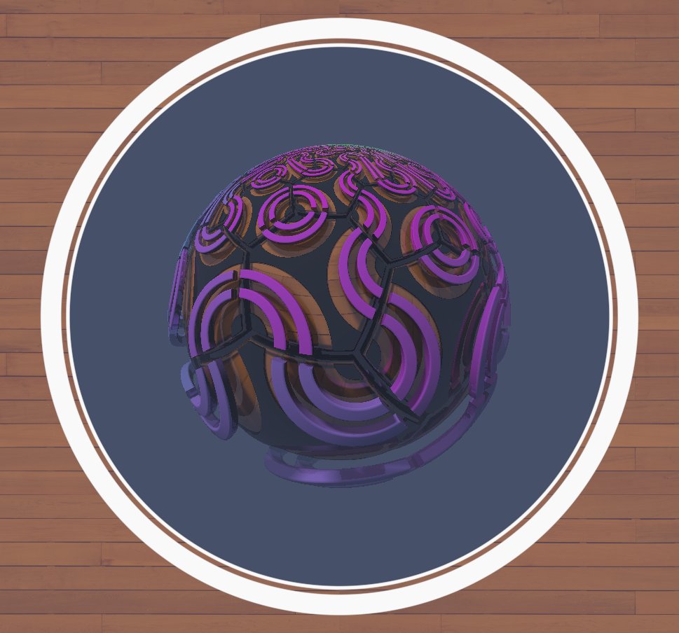

# WebGL Bootstrap featuring TWGL.js and VITE

This is a simple bootstrap for creating a webGL Canvas and attachng a Fragment / Vertex Shader program to the GPU with TWGL.js

The Shaders are loaded in as template strings then atached to as a GPU program to the canvas. 

A basic Uniforms loop, which sends in variables to the shader running on the GPU each frame refresh. Time since init, mouse xy position, and mouse click. Two textures are loaded asynchronous and added to the Uniforms. More textures or other various data can be added as needed.

Included:
- Simple CSS file for the body and canvas element to force full width
inside the browser. 
- Basic Mouse class to capture positional data and mouse clicks.
- Simple asynchronous texture loader for static images. 

## Sample site
https://webgl-twgl-bootstrap.surge.sh/

Todos:

- buffer shaders
- joypad input
- video sampler2D
- audio sampler2D
- asset mangement
